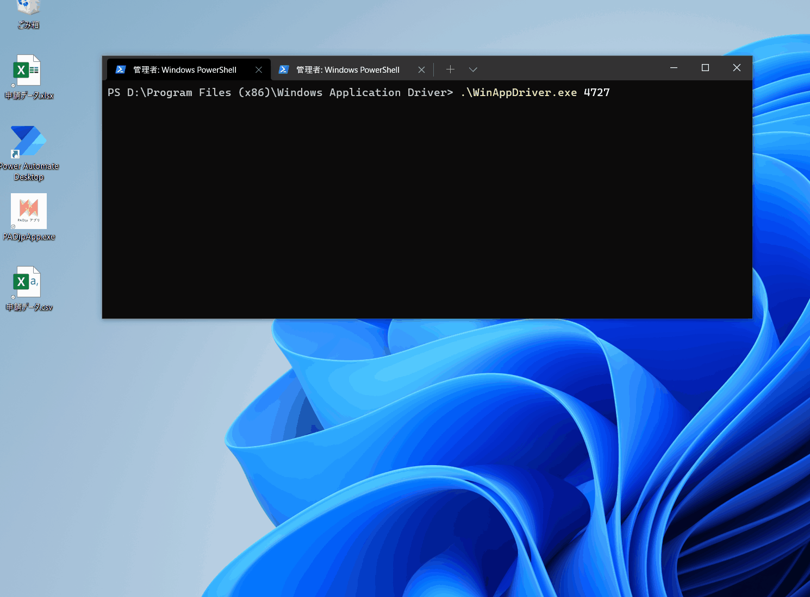

# PADjpAppSharp
[PADjp / Study-Session-003](https://github.com/PADjp/Study-Session-003) のフローをSelenium + WinAppDriverで実装したサンプルです。コンソールアプリでなくテストプロジェクトになっているのには深い理由はありません…。

## Prerequisite
* .NET 6
* [WinAppDriver.exe](https://github.com/microsoft/WinAppDriver/releases)が任意のパスに配置されていること
* [こちら](https://github.com/PADjp/Study-Session-003/tree/main/HandsOn) のファイルがデスクトップに配置されていること

※ WinAppDriverのデフォルトのポートは4723です。gifでは別ポートでテストしています。